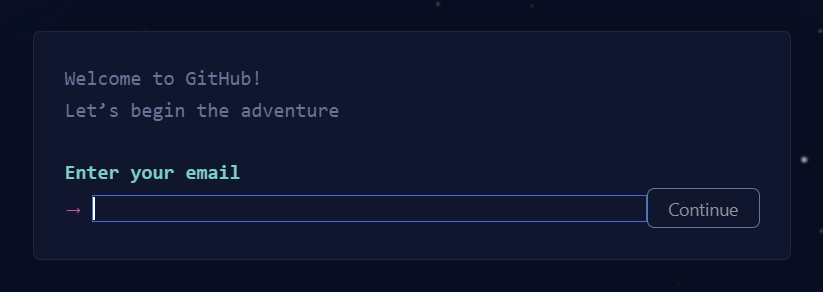
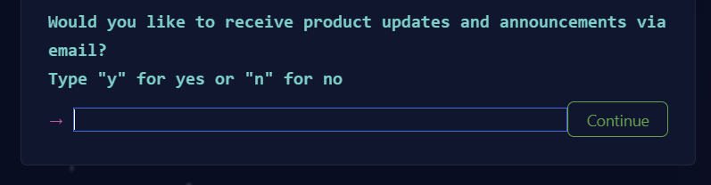
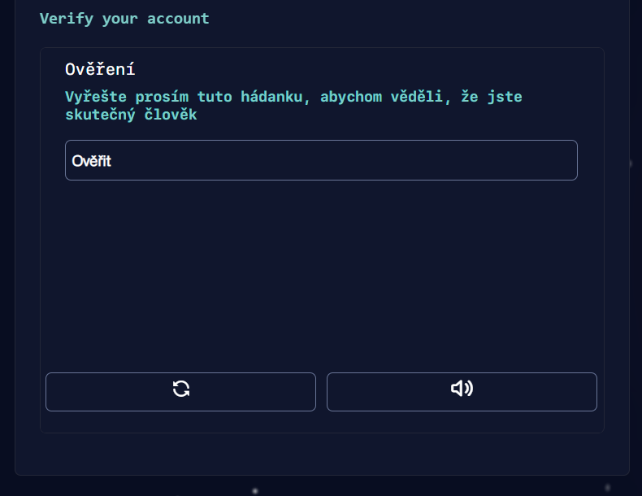
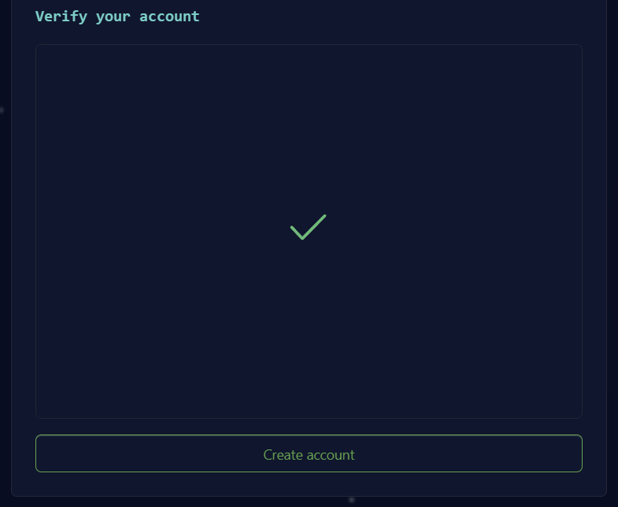
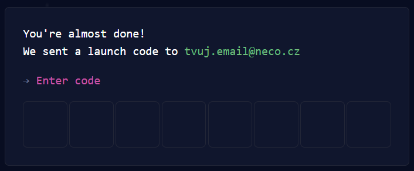
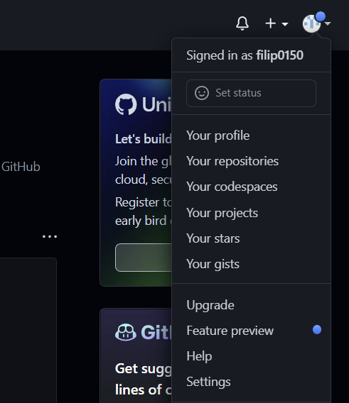

# Založení účtu na GitHubu

Kromě samotného programu Git se hodí mít i nějaký online účet, kam budeš práci pomocí Gitu zálohovat. Jedna z nejpopulárnějších služeb, která toho navíc nabízí spoustu zdarma, se jmenuje GitHub.

Pokud již máš účet na [Github.com](https://github.com/), do kterého se umíš přes webový prohlížeč přihlásit, tak můžeš následující kroky přeskočit.

1. V případě, že účet ještě nemáš, jdi na adresu [https://github.com/](https://github.com/) a v pravém horním rohu zvol možnost registrovat se (`Sign up`).

   

1. V následujícím kroku tě interaktivní průvodce registrací vyzve k zadání tvé e-mailové adresy (`Enter your email`). Zadej adresu, kterou si pamatuješ, běžně používáš. Pokud ji později zapomeneš, můžeš přijít o zazálohovanou práci.

   

1. Po zadání adresy pokračuj zeleným tlačítkem (`Continue`).

   

1. Dále vymysli silné heslo, které si budeš pamatovat nebo si ho ulož do správce hesel, pokud nějaký používáš. Pokračuj zeleným tlačítkem.

   

1. Vymysli si unikátní uživatelské jméno. Toho jméno uvidí i ostatní uživatelé. Pro přehlednost můžeš použít kombinaci jména a příjmení. Například `AdelaRychla`. Pokud chceš zatím vystupovat více inkognito, zvol nějakou přezdívku. Uživatelské jméno jde později změnit.

   

1. Produktová oznámení e-mailem můžeš klidně odmítnout. Napiš `n` a pokračuj zeleným tlačítkem. Nemusíš se bát, že přijdeš důležité informace.

   

1. V další kroku vyřeš hádanku, aby si GitHub ověřil, že jsi člověk.

   

1. Potvrď vytvoření účtu tlačítkem (`Create account`).

   

1. Přepiš ověřovací kód, který ti dorazil na e-mail.

   

1. Následující dotazník klidně přeskoč odkazem v dolní části stránky (`Skip personalization`).

   

1. Výborně. Máš hotovo. Tvůj účet si můžeš kdykoliv doupravit ze stránky [github.com](https://github.com/) kliknutím na tvé uživatelské kolečko v pravém horním rohu po rozkliknutí v záložce nastavení (`Settings`).

   
