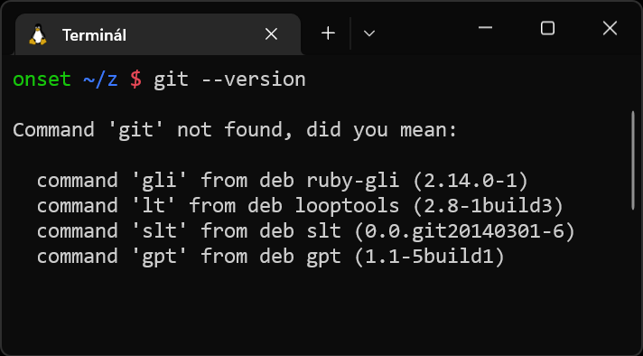

# Instalace Gitu  v Linuxu 

Na Linuxu máš s největší pravděpodobnostní program `git` již nainstalovaný. Správnost instalace ověříš následovně:

1. Otevří příkazovou řádku / terminál.

1. Napiš do ní `git --version` a stiskni klávesu `Enter`.

1. Pokud se ti na další řádek vypsalo něco zhruba v podobě `git version 2.33.0`, máš Git nainstalovaný a nemusíš nic víc řešit.

   

1. Pokud se vypsalo něco jako `Command 'git' not found, did you mean: …`, pokračuj podle instrukcí v dalším bodě.

   

1. Vyber a použij příkaz příslušící tvé linuxové distribuci podle instrukcí na stránce [git-scm.com/download/linux](https://git-scm.com/download/linux).
   Možná budeš muset nalezený příkaz spustit se superuživatelskými právy - na to použij příkaz `sudo`, tedy např. `sudo apt-get install git`.

1. Po instalaci ověř přítomnost programu `git` podle bodů 2 a 3.
