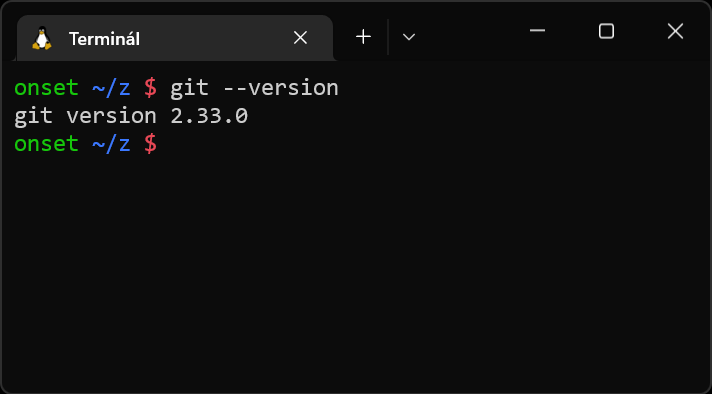

# Linux

Na Linuxu máš s největší pravděpodobnostní program `git` již nainstalovaný. Správnost instalace ověříš následovně:

1. Otevří příkazovou řádku / terminál.

1. Napiš do ní `git --version` a stiskni klávesu `Enter`.

1. Pokud se ti na další řádek vypsalo něco zhruba v podobě `git version 2.33.0`, máš Git nainstalovaný a nemusíš nic víc řešit.

   

1. Pokud se vypsalo něco jako `Command 'git' not found, did you mean: …`, pokračuj podle instrukcí v dalším bodě.

   

1. V závislosti na tvé konkrétní distribuci vyzkoušej některý z příkazů na stránce [git-scm.com](https://git-scm.com/download/linux).

1. Terminál zavři a vrať se k prvnímu kroku.
