# Instalace Gitu  ve Windows 

Program `Git` není standardní výbavou systému Windows. Pravděpodobně ho nemáš ještě nainstalovaný. Začni tím, že ověříš, že ho opravdu namáš následovně.

1. Spusť příkazovou řádku / command prompt / `cmd.exe`. To uděláš například tak, že stiskneš na klávesnici najednou **klávesu s logem Windows a písmeno `r`**. Vlevo dole na tebe vyskočí okénko, do kterého napiš `cmd` a klikni na `OK`.

   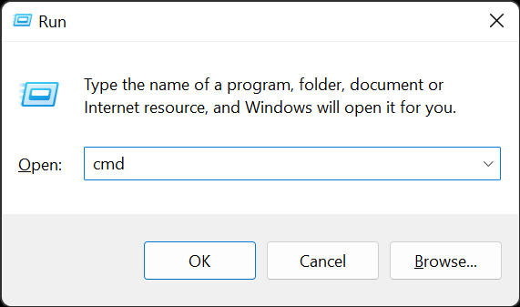

1. Ihned se ti otevře černá příkazová řádka. Napiš do ní `git --version` a stiskni klávesu `Enter`.

1. Na dalších řádcích by se ti mělo vypsat `'git' is not recognized as an internal or external command, operable program or batch file.`, což znamená, že Git opravdu ještě nainstalovaný nemáš a můžeš tak pokračovat podle kroků níže. Pokud se ti vypsalo něco jako `git version 2.37.1.windows.1`, tak Git už máš a nemusíš už nic dál řešit. V obou případech příkazovou řádku zase zavři.

   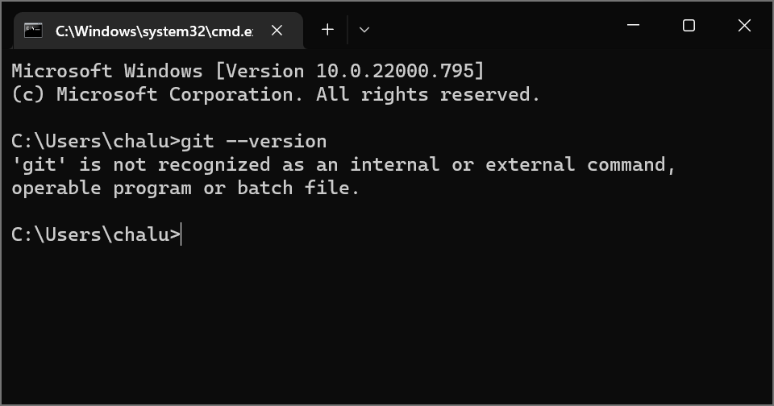

1. Pro instalaci Gitu jdi na stránku [git-scm.com](https://git-scm.com) a stáhni a spusť instalační soubor pro Windows.

   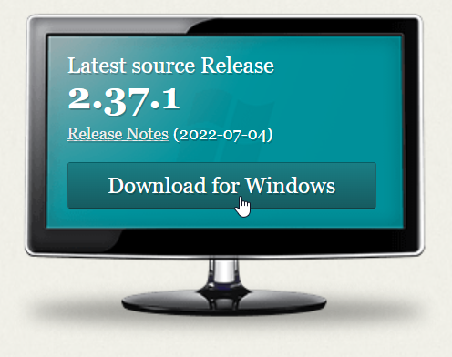

   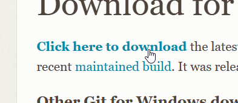

1. Po spuštění instalace budeš muset odklikat větší množství otázek. Většina z nich není příliš zásadní a je je možné celkem bezmyšlenkovitě odklikat. Pojďmě si je ale stejně projít společně.

1. V prvním kroku musíš odsouhlasit podmínky použití. **Klikni na `Next`, tedy česky `pokračovat`**.

   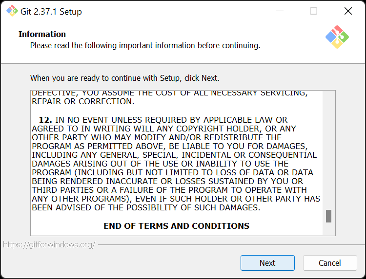

1. V dalším kroku volíš, kam se Git nainstaluje. Výchozí úmístění nebývá zvykem měnit. **Můžeš dát rovnou `Next`**.

   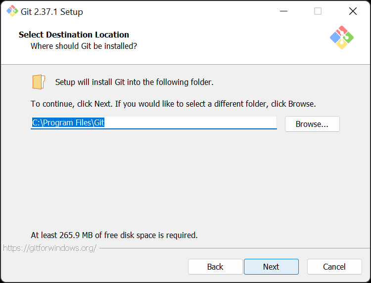

1. Dále se tě instalace zeptá na doplňkové komponenty. Nic z toho používat nebudeme. **Můžeš zrušit všechna zaškrtnutí a dát `Next`**.

   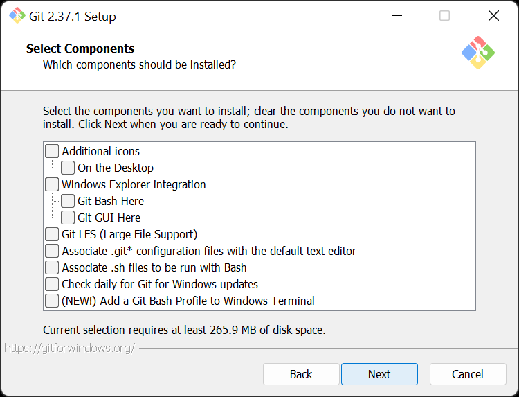

1. Název programu nech nastavený na `Git` a **pokračuj**.

   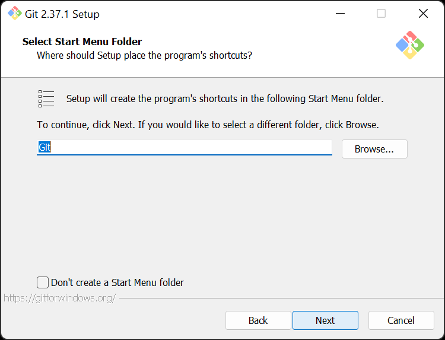

1. Dále se budeš muset rozhodnout, s jakým textovým editorem má Git spolupracovat. **Klidně nech předvolenou volbu `vim`**. Jak toto rozhodnutí změnit si ukážeme případně později, až to bude potřeba. (Pokud víš, co je program `Visual Studio Code` a máš ho nainstalovaný, uděláš lépe, když ho tady rovnou zvolíš, ale opravdu to není teď úplně nutné. Případně můžeš zvolit `Notepad`.)

   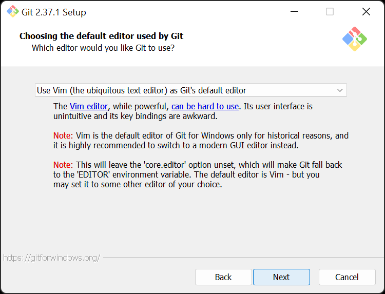

   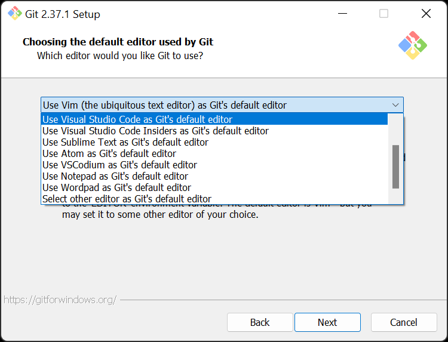

1. Při pokročilé práci s Gitem hrají roli takzvané větve. V nedávné době byla velká debata, jestli té nejdůležitější větvi říkat `master` nebo `main`. Od původního názvu `master`, který připomíná otrokářství se postupně upouští. **Zvolením `main` jistě neuděláš špatně**.

   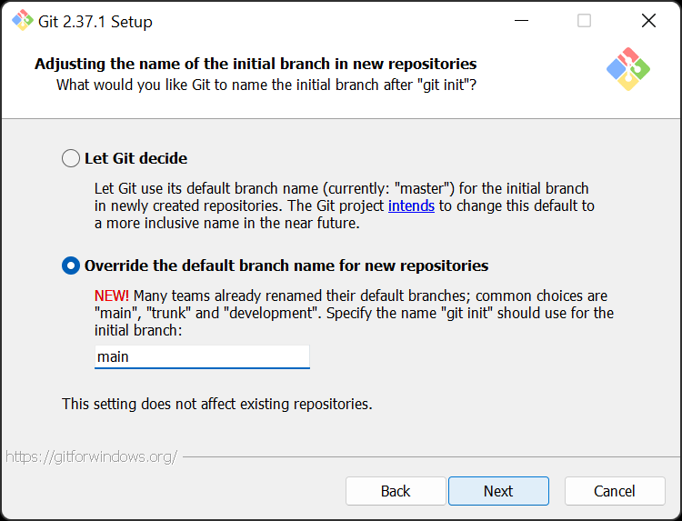

1. V dalším kroku budeš volit, jak se má Git integrovat do celého systému. Nejvhodnější je již předvolená prostřední možnost. **Můžeš dát rovnou `Next`**.

   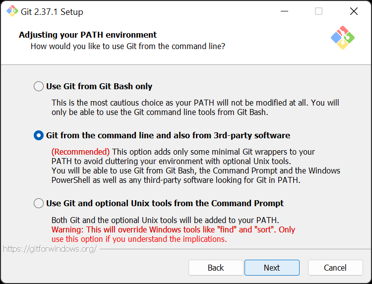

1. Git potřebuje pro své správné fungování malý program `OpenSSH`, který nemusí být v tvé verzi systému předinstalovaný. Nech předvybranou možnost a **dej `Next`**.

   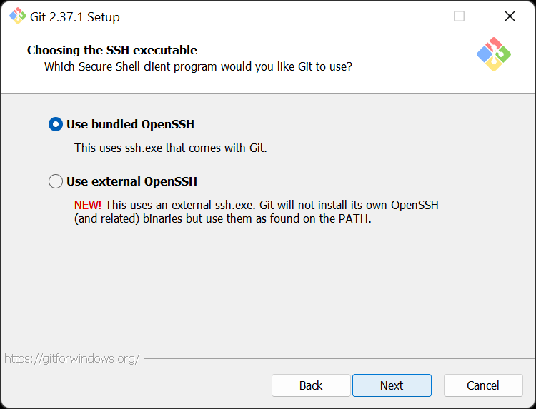

1. Něco podobného platí i pro `OpenSSL`, které s předchozím programem souvisí. **Dej `Next`**.

   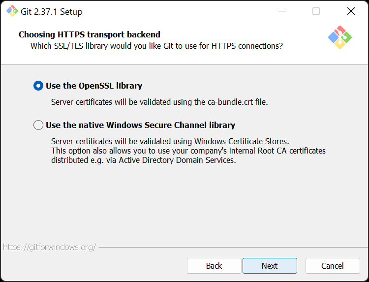

1. Různé operační systémy (Windows, Mac, Linux) oddělují řádky v textu různými neviditelnými znaky. Tyto rozdíli v této fázi určitě není potřeba rozlišovat, takže si jistě vystačíš s předvolenou první možností. **Můžeš dát `Next`**.

   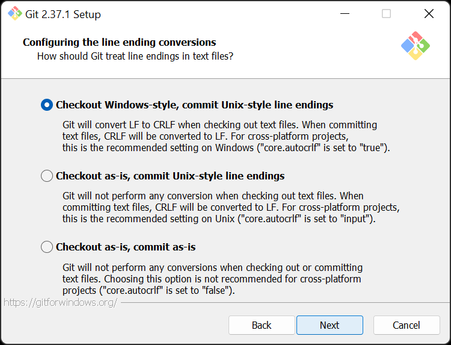

1. Tato instalace nabízí doplňkový terminál `MinTTY`. Na disku zabere minimum místa, takže ho klidně nech zvolený, i když ho pravděpodobně nepoužijeme.

   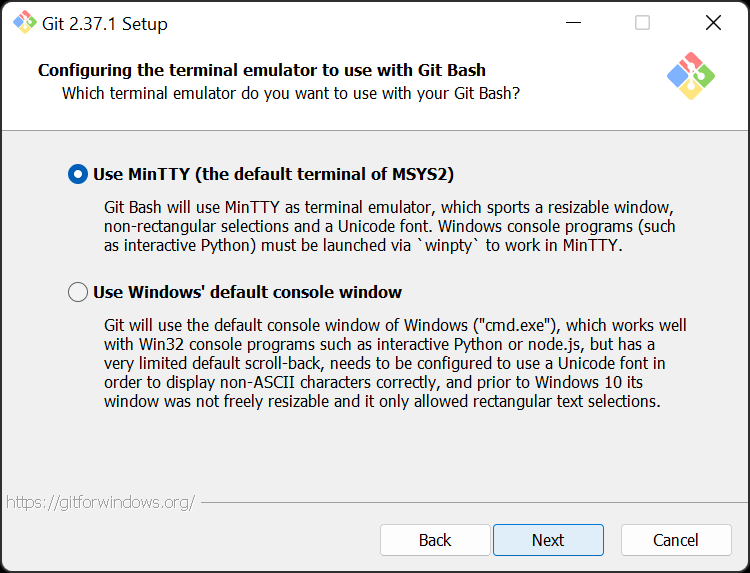

1. `git pull` je pokročilejší funkce Gitu. Aby tě později chování Gitu nepřekvapilo, **nech zvolenou předvybranou první možnost**.

   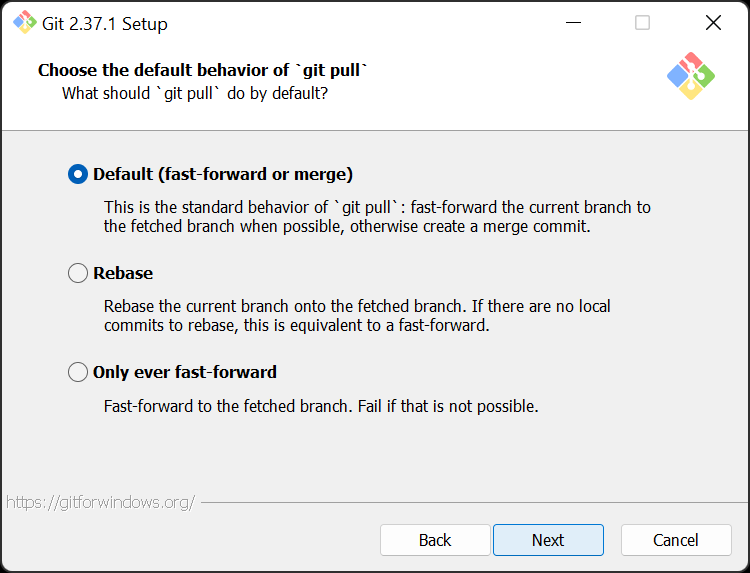

1. Protože později Git budeš používat se svým online účtem na [GitHubu](https://github.com/), bude si Git muset někam uložit tvé přístupové údaje. **Nech zvolenou možnost `Git Credential Manager`**.

   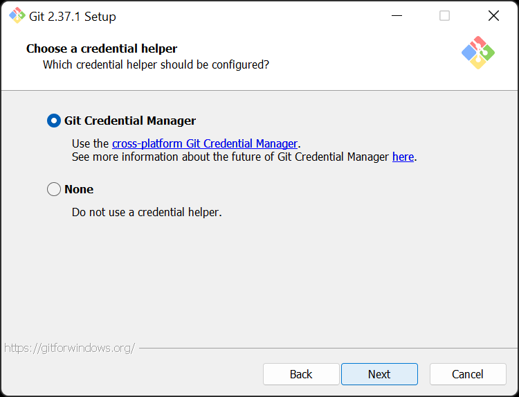

1. Aby Git pracoval co nejrychleji, **nech zvolenou první možnost** `Enable file system caching`. Druhá možnost se týká pokročilejšího použití a **nemusíš ji řešit**.

   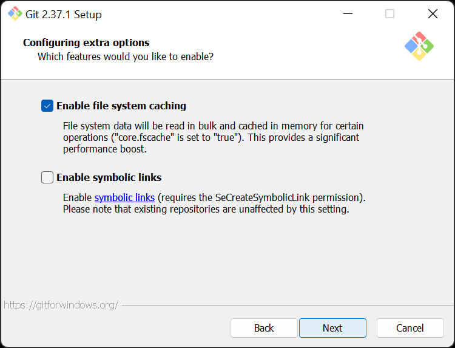

1. Žádné **experimentální funkce v dalším kroku nepovoluj**. Git by se mohl začít chovat neobvykle, což by bylo matoucí.

   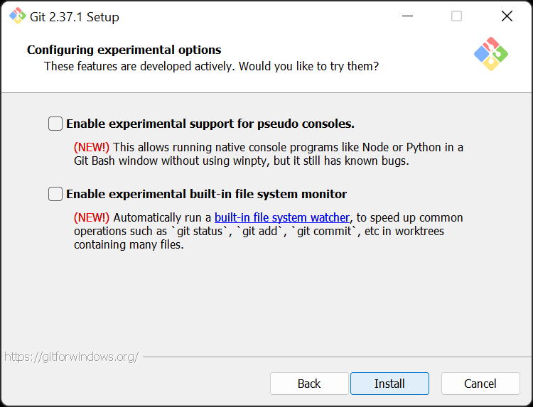

1. Počkej, až instalace doběhne.

   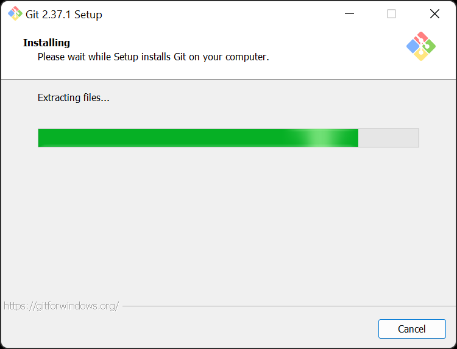

1. V závěrečném kroku není potřeba si zobrazit poznámky o vydání poslední verze. **Zruš tedy zaškrtnutí** volby `View Release Notes` a klikni na `Finish`, česky `dokončit`.

   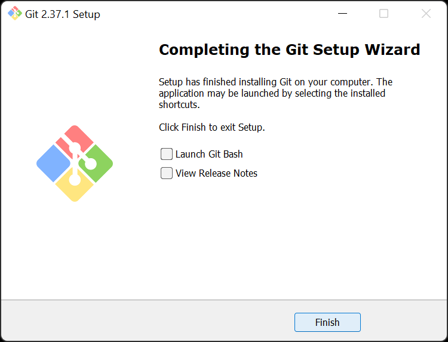

1. **Ověř, že se ti podařilo Git úspěšně nainstalovat**. Podle kroků úplně na začátku otevři příkazovou řádku, zadej do ní `git --version` a stiskni klávesu `Enter`. Na dalším řádku by se ti mělo vypsat `git version 2.37.1.windows.1`. Je možné, že ve verzi budeš mít vyšší číslo, což není na škodu a znamená to, že od vydání tohoto postupu vyšla novější verze Gitu.

   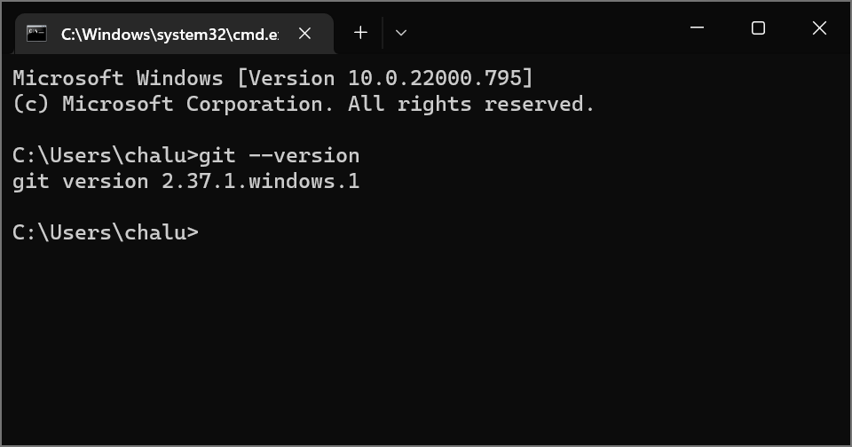
